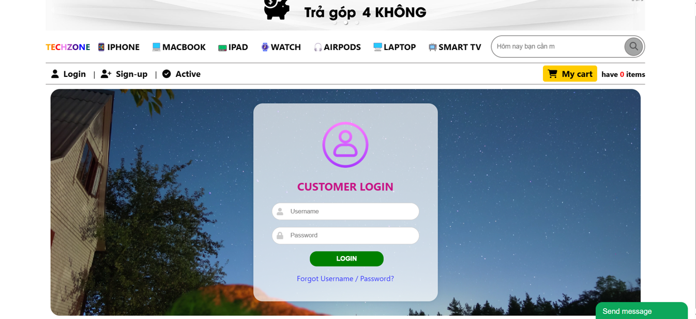
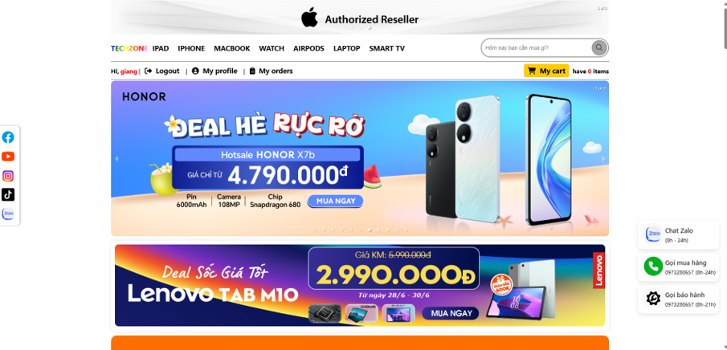
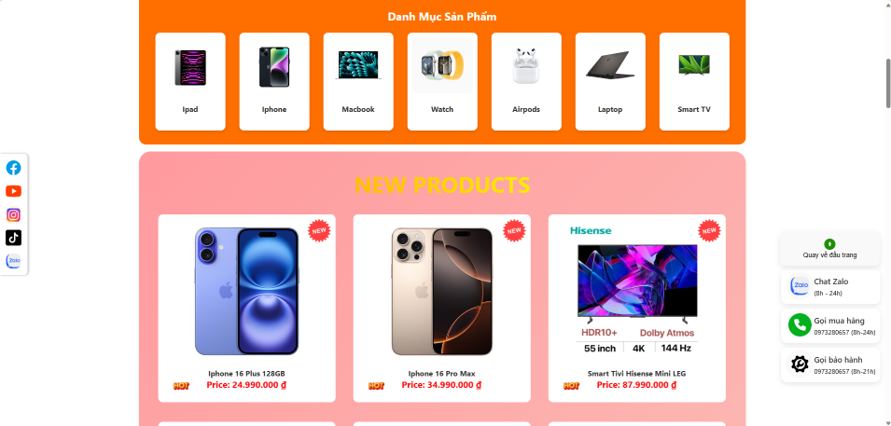
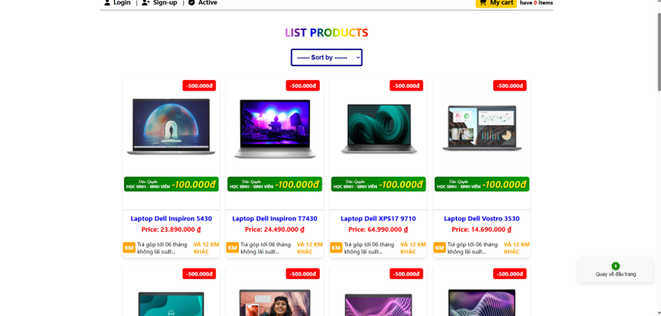
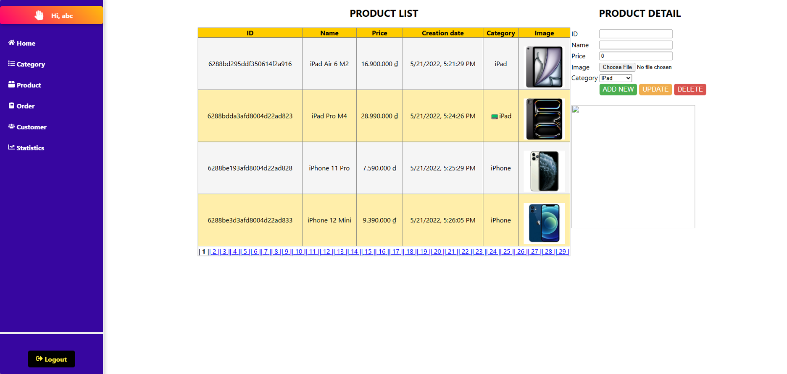
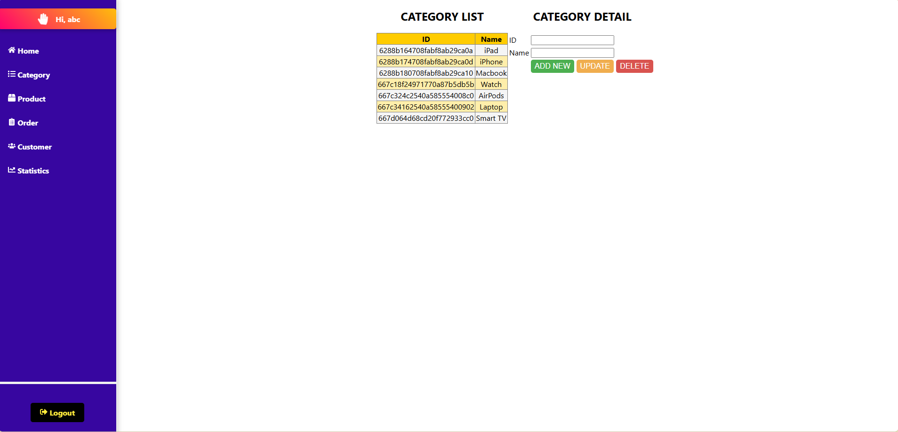
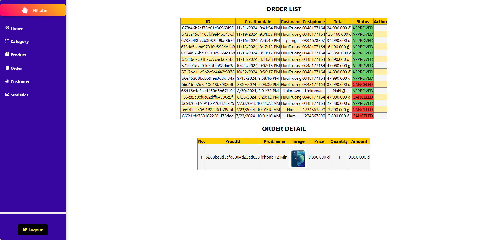
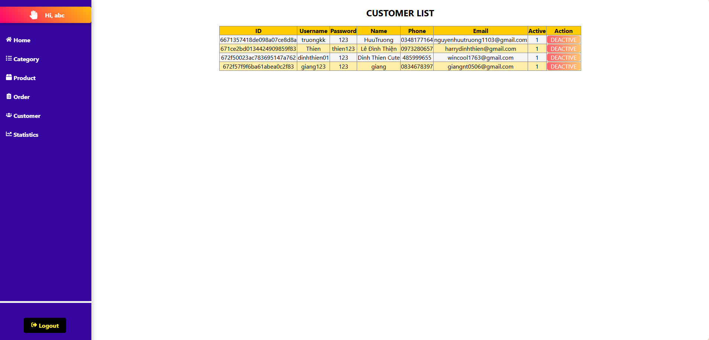
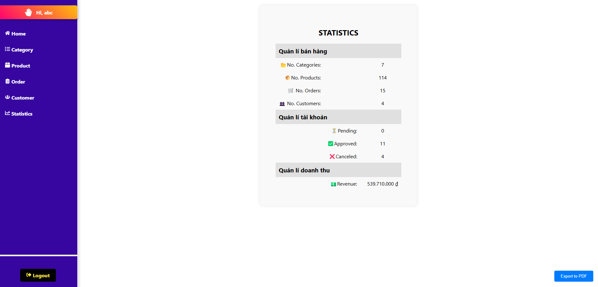

# TECHZONE
  _Giao diện Website TechZone_

  

  
  
  
  

  
  ___Giao diện trang chủ của website___
  

Với nhu cầu mua sắm trực tuyến hiện nay ngày càng tăng, việc tạo ra website nhằm giúp khách hàng đáp ứng được nhu cầu và dễ dàng tham khảo các sản phẩm.Ngoài ra, còn giúp quản trị viên có thể quản lý được hàng hóa và đơn hàng tiện hơn.

  
  
  
  
  

  
  ___Giao diện các chức năng của quản trị viên___
  

Từ dự án trên giúp tôi có thêm nhiều kinh nghiệm về lập trình web và rèn luyện kỹ năng thiết kế giao diện,xử lý dữ liệu, phân quyền truy cập, từ đó hiểu rõ hơn quy trình xây dựng một website thương mại điện tử hoàn chỉnh.

- https://www.tawk.to/
- https://dashboard.render.com/
- npm install express
